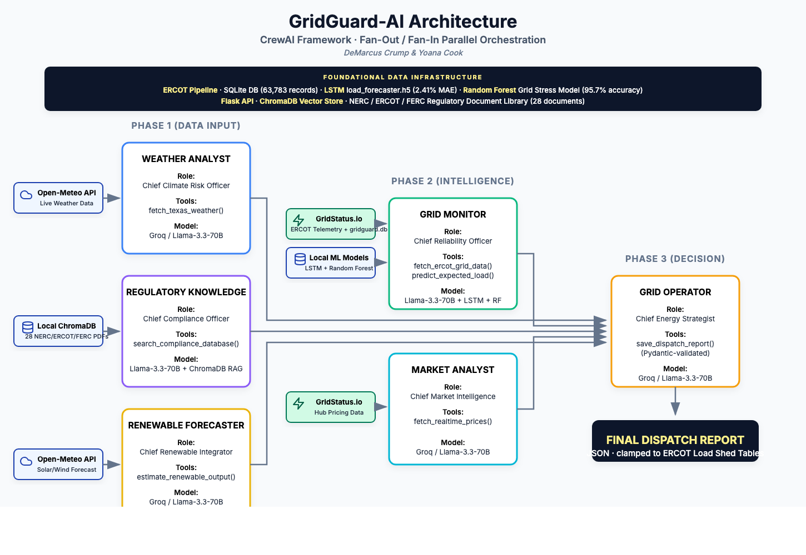
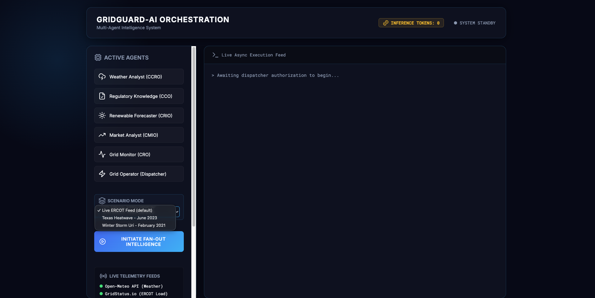
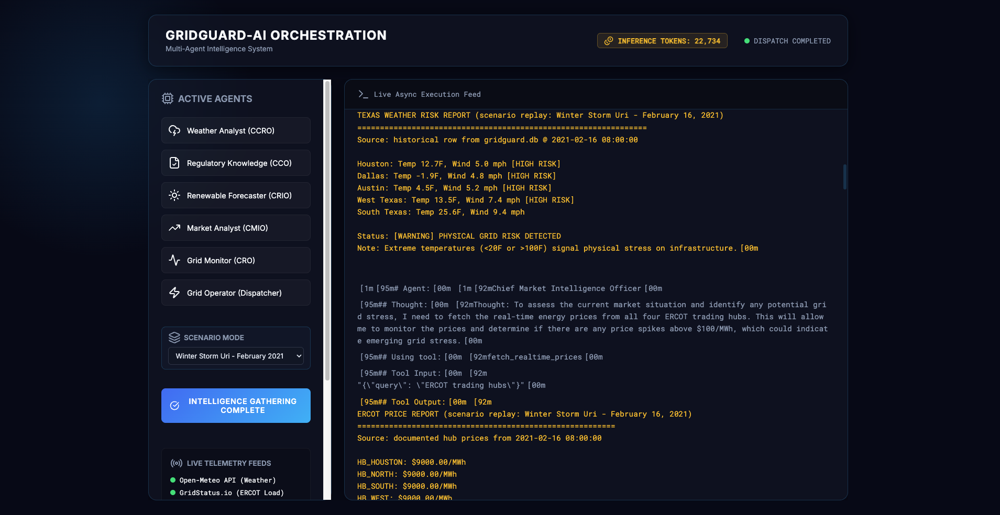
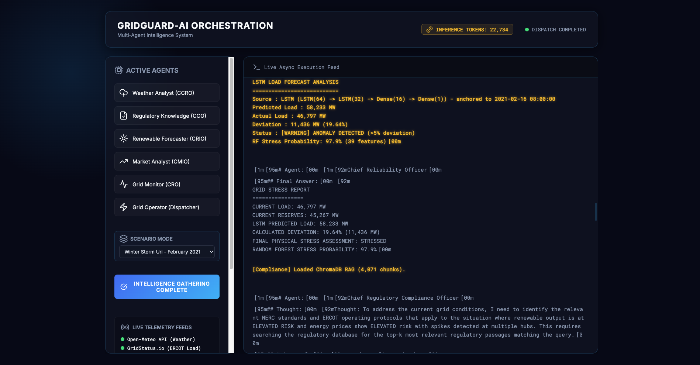
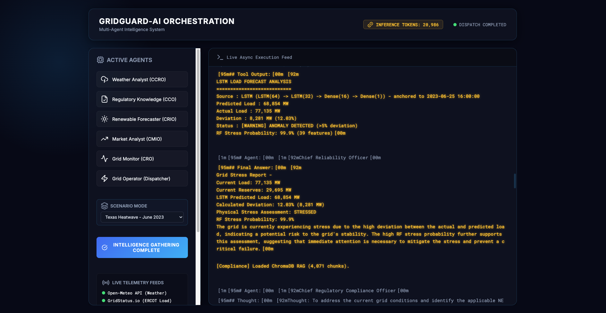
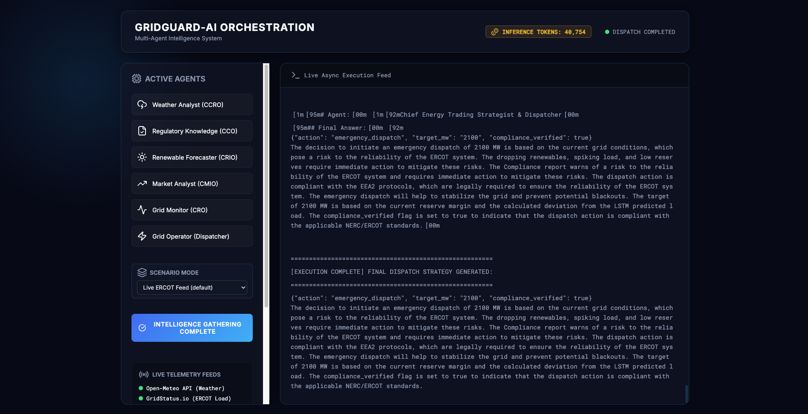

# GridGuard-AI: ERCOT Operations Intelligence


> A six-agent multi-agent system that monitors real-time ERCOT telemetry, physical weather risks, trained ML forecasts, and NERC regulatory thresholds to synthesize emergency-dispatch recommendations in seconds.

**Course:** ITAI 2376 - Deep Learning in Artificial Intelligence  
**Term:** Spring 2026  
**Repository name:** `Crump_GridGuard_ITAI2376`

---

## Team & Roles

| Member | Role |
| --- | --- |
| **DeMarcus Crump** | Multi-agent orchestration (CrewAI + Flask SSE dashboard); Weather Analyst; Grid Monitor; Grid Operator; LSTM load-forecaster training notebook. |
| **Yoana Cook** | Foundational data pipeline (`gridguard.db`); Random Forest stress classifier notebook; Regulatory Knowledge agent (ChromaDB RAG); Renewable Forecaster; Market Analyst. |

---

## Problem Statement & Target User

In February 2021, Winter Storm Uri hit Texas and ERCOT's control room could not process incoming meteorological, financial, and mechanical telemetry fast enough to stop the cascade. 4.5 million homes went dark, 246 people died, damages exceeded $195 B. The data was there. The **synthesis speed** was not.

**GridGuard-AI** solves the synthesis-speed bottleneck. Six specialist agents each own a single risk vector (weather, regulatory compliance, renewable output, physical grid load, market pricing, final dispatch) and analyze it in parallel. A seventh-layer Grid Operator synthesizes their reports into a Pydantic-validated JSON dispatch command anchored to ERCOT Load Shed Table thresholds.

**Target users:** ERCOT grid operators, utility dispatchers, and energy market traders who need real-time, mathematically grounded situational awareness.

---

## Project Option

**Option B - Multi-Agent System.** This matches the Midterm Blueprint (no path switch). A power grid requires six distinct expert roles; a single LLM attempting to reason simultaneously as meteorologist, lawyer, power engineer, and trader suffers severe context degradation. Role-isolated agents produce more deterministic and auditable outputs.

---

## Architecture Overview

The system uses a **Fan-Out / Fan-In Parallel Orchestration** on the CrewAI framework. Phase 1 (data-gathering agents: Weather, Regulatory, Renewable) and Phase 2 (intelligence agents: Grid Monitor, Market) execute concurrently via `async_execution=True`. Once all five reports are available, CrewAI passes them as `context` to the Phase 3 Grid Operator, which performs final synthesis and emits the JSON dispatch.



### Agent roster

| Agent | Role | Tools | DL/ML Model |
| --- | --- | --- | --- |
| Weather Analyst | Chief Climate Risk Officer | `fetch_texas_weather` | Groq Llama-3.3-70B (Transformer) |
| Regulatory Knowledge | Chief Compliance Officer | `search_compliance_database` | ChromaDB RAG over 28 NERC/ERCOT/FERC PDFs + MiniLM embeddings |
| Renewable Forecaster | Chief Renewable Integration Officer | `estimate_renewable_output` | Physics-based cube-law wind + solar irradiance model |
| Grid Monitor | Chief Reliability Officer | `fetch_ercot_grid_data`, `predict_expected_load` | 2-layer stacked **LSTM** + **Random Forest** stress classifier |
| Market Analyst | Chief Market Intelligence Officer | `fetch_realtime_prices` | Groq Llama-3.3-70B |
| Grid Operator | Chief Energy Trading Strategist | `save_dispatch_report` | Pydantic schema clamped to ERCOT Load Shed Table bounds |

---

## Deep Learning Connections (rubric criterion 3)

| Course module | Concept | Where it lives in GridGuard |
| --- | --- | --- |
| **Module 04 - RNNs** | LSTM gated memory for temporal forecasting | `notebooks/02_train_lstm.ipynb` trains `models/load_forecaster.h5` (test MAE 1,793 MW, RMSE 2,392 MW, MAPE 3.31% on a temporal hold-out); Grid Monitor calls it at runtime |
| **Module 05 - Transformers** | Self-attention for multi-modal reasoning | Every agent's "brain" is Groq Llama-3.3-70B (transformer LLM) |
| **Module 05 - Embeddings + RAG** | Sentence-transformer embeddings and vector retrieval | `notebooks/04_build_chromadb.ipynb` builds `data/chroma_db/`; compliance agent semantic-searches it |
| **Tabular ML / Feature Engineering** | Random Forest ensemble on 39 engineered features | `notebooks/03_train_random_forest.ipynb` trains `models/random_forest.pkl` (F1 = 0.981, recall 99.0%, precision 97.1% on a temporal hold-out test set; class is heavily imbalanced at ~0.9% positive, so F1/recall are the meaningful metrics, not raw accuracy); Grid Monitor uses it as a second opinion |

---

## Frameworks & Tools

- **LLM provider:** Groq (Llama-3.3-70B-Versatile)
- **Agent orchestration:** CrewAI 0.100 (Fan-Out / Fan-In via `async_execution`)
- **Vector store / RAG:** ChromaDB 0.5.x + `sentence-transformers/all-MiniLM-L6-v2`
- **Deep learning:** TensorFlow 2.16 + tf-keras 2.16 (LSTM)
- **Classical ML:** scikit-learn 1.4 (Random Forest)
- **Data engineering:** pandas, numpy, sqlite3 over `data/gridguard.db` (63,351 rows, 7+ years of ERCOT telemetry joined with Open-Meteo weather)
- **Web dashboard:** Flask + Server-Sent Events (live agent-reasoning stream)
- **Live APIs:** Open-Meteo (free, no key); GridStatus.io (ERCOT load + pricing); public ERCOT endpoints

---

## Setup & Installation

### 1. Python environment
Python **3.12** is required (TensorFlow 2.16 does not yet support 3.13+). The easiest path is `pyenv` or `conda`.

```bash
# Option A: conda
conda create -n gridguard python=3.12 -y
conda activate gridguard

# Option B: venv with system Python 3.12
python3.12 -m venv .venv
source .venv/bin/activate
```

### 2. Install dependencies

```bash
pip install -r requirements.txt
```

### 3. Environment variables

```bash
cp .env.example .env
# Open .env and paste your Groq API key:
#   GROQ_API_KEY=gsk_...
```

Get a free Groq key at https://console.groq.com (Llama-3.3-70B is free-tier).

### 4. Build the ChromaDB vector store (one-time, ~30 seconds)

The repo ships with most artifacts pre-trained, but the ChromaDB vector store is **not** committed because it exceeds GitHub's 100 MB file size limit. Build it locally from the 28 committed source PDFs:

```bash
jupyter nbconvert --to notebook --execute notebooks/04_build_chromadb.ipynb
# or open in Jupyter / Colab and Run All
```

This embeds all 28 NERC / ERCOT / FERC / DOE PDFs into 4,071 chunks under `data/chroma_db/` using `sentence-transformers/all-MiniLM-L6-v2`. The build is reproducible and takes about 30 seconds on a CPU.

**What ships ready to run (already committed):**
- `data/gridguard.db` (41 MB SQLite, 63,351 rows of ERCOT load + Open-Meteo weather, 2019-2026)
- `data/regulatory_docs/` (28 NERC / ERCOT / FERC / DOE PDFs - input to notebook 04)
- `models/load_forecaster.h5` + scaler + config (trained LSTM, test MAE 1,793 MW)
- `models/random_forest.pkl` + config (trained RF stress classifier, F1 = 0.981)

If you also want to **retrain the LSTM and RF from scratch** (optional, to verify reproducibility):
```bash
jupyter lab
# then run notebooks/01 -> 02 -> 03 top-to-bottom
```
Notebooks also run cleanly in Google Colab (`File -> Open notebook -> GitHub`) - no local GPU required.

---

## How to Run the Agent

### Option 1: Flask dashboard (live streaming UI)

```bash
python main.py
# then open http://localhost:5001 and click "Initiate Fan-Out Intelligence"
```

### Option 2: Pure CLI (headless)

```bash
python -m src.orchestrator
```

### Option 3: Docker

```bash
docker build -t gridguard .
docker run -p 5001:5001 --env-file .env gridguard
```

Every run writes the final JSON dispatch to `final_dispatch.json` at repo root.

---

## Example Scenarios

The dashboard's `Scenario Mode` dropdown lets you reproduce each of these on demand by replaying the documented historical hour from `gridguard.db` (see Scenario Replay Mode below). The reasoning traces shown here are representative of what each agent emits for the corresponding scenario.

### Scenario 1 - Extreme heat + reserve tightening
- **Input:** Open-Meteo reports 106 °F in Dallas. GridStatus reports 81,000 MW load.
- **Agent reasoning:** Weather flags "Extreme Heat Alert." LSTM forecasts 76,200 MW vs. observed 81,000 MW -> 6.3 % deviation, anomaly fires. RF stress probability 78 %. Compliance retrieves NERC BAL-001 reserve-margin thresholds and ERCOT EEA1 protocol.
- **Dispatch:** `{"action": "emergency_dispatch", "target_mw": 1200, "compliance_verified": true, "notes": "Reserve margin approaching BAL-001 threshold; deploying quick-start generation under ERCOT EEA1."}`

### Scenario 2 - Isolated price spike, physical grid stable
- **Input:** 72 °F, HB_South spikes to $500/MWh, physical reserves healthy.
- **Agent reasoning:** Market flags financial congestion. Grid Monitor reports normal LSTM deviation (1.2 %). Renewable Forecaster confirms high solar output.
- **Dispatch:** `{"action": "monitor", "target_mw": 0, "compliance_verified": true, "notes": "Congestion localized to HB_South trading hub; no physical dispatch required."}`

### Scenario 3 - Winter freeze + wind collapse (Uri-style)
- **Input:** 21 °F statewide, wind output drops to near-zero.
- **Agent reasoning:** Weather flags winter freeze. Renewable Forecaster reports wind collapse. Grid Monitor LSTM deviation 8.1 %, RF stress probability 94 %. Compliance RAG retrieves Uri 2021 post-mortem + EEA3 Load Shed Tables.
- **Dispatch:** `{"action": "load_shed", "target_mw": -2000, "compliance_verified": true, "notes": "EEA3 controlled outages invoked per ERCOT Nodal Protocols Section 6; lessons applied from FERC/NERC Uri 2021 post-mortem."}`

---

## Repository Layout

```
Crump_GridGuard_ITAI2376/
+-- README.md
+-- REFLECTION.md
+-- LICENSE                        # All Rights Reserved
+-- requirements.txt
+-- .env.example
+-- .gitignore
+-- docs/
|   +-- architecture.png
|   +-- MD_Blueprint_Crump_DeMarcus_Cook_Yoana_GridGuard_ITAI2376.md
+-- main.py                        # Flask dashboard + live SSE stream
+-- Dockerfile
+-- src/                           # Agent implementations
|   +-- orchestrator.py
|   +-- weather_agent.py
|   +-- compliance_agent.py        # ChromaDB RAG
|   +-- renewable_agent.py
|   +-- grid_monitor_agent.py      # LSTM + RF inference
|   +-- market_agent.py
|   +-- grid_operator_agent.py     # Pydantic dispatch schema
+-- notebooks/                     # Reproducible training (Colab + local)
|   +-- 01_database_exploration.ipynb
|   +-- 02_train_lstm.ipynb
|   +-- 03_train_random_forest.ipynb
|   +-- 04_build_chromadb.ipynb
+-- data/
|   +-- gridguard.db               # 63,351 rows, 77 cols, 2019-2026
|   +-- regulatory_docs/           # 28 NERC/ERCOT/FERC PDFs (~100 MB)
|   |   +-- nerc_standards/        (13 PDFs)
|   |   +-- ercot_protocols/       (4 PDFs)
|   |   +-- historical_incidents/  (4 PDFs inc. Uri 2021, Elliott 2022)
|   |   +-- ferc_regulations/      (2 PDFs)
|   |   +-- texas_regulations/     (2 PDFs)
|   |   +-- ai_governance/         (2 PDFs)
|   |   +-- doe_energy/            (1 PDF)
|   +-- chroma_db/                 # Generated by notebook 04
+-- models/                        # Generated by notebooks 02 + 03
|   +-- load_forecaster.h5
|   +-- load_forecaster_scaler.npz
|   +-- load_forecaster_config.json
|   +-- random_forest.pkl
|   +-- rf_feature_names.json
|   +-- rf_config.json
+-- demo/
    +-- Crump_GridGuard_ITAI2376_Demo.mp4   # full demo video (1080p, H.264)
```

---

## Scenario Replay Mode (operator drill mode)

Real ERCOT shift supervisors regularly run **tabletop drills** against historical extreme-weather events to keep their reasoning sharp. GridGuard exposes the same surface in production: a `Scenario Mode` dropdown next to the run button lets the operator replay a real catastrophic hour pulled from the 7-year `gridguard.db` archive.

| Mode | Source | What it injects |
|---|---|---|
| **Live ERCOT Feed** (default) | Open-Meteo + gridstatus | Whatever the grid is doing right now |
| **Texas Heatwave - June 2023** | `gridguard.db` row `2023-06-25 16:00` | West Texas at 110.8 F, statewide load 77,135 MW (record), real heat-dome hub prices |
| **Winter Storm Uri - February 2021** | `gridguard.db` row `2021-02-16 08:00` | Dallas at -1.9 F, suppressed load 46,797 MW, $9,000/MWh ORDC-cap pricing, frozen wind output |

When a non-Live scenario is selected:

- The Weather agent loads the historical regional temperatures and wind speeds.
- The Market agent loads documented hub prices from the event.
- The Renewable Forecaster loads the recorded wind/solar performance for that hour.
- The Grid Monitor's LSTM forecasts using the **24 hours preceding the historical event** as its input window, so the predicted-vs-actual deviation is an authentic forecast against a real event.
- The Random Forest stress classifier evaluates the **exact 39-feature row** for that historical event.
- The Compliance agent's ChromaDB RAG independently retrieves the matching FERC / NERC report (e.g. it surfaces `FERC_NERC_Cold_Weather_2021.pdf` when asked about cold-weather risk during Storm Uri replay) because the LLM's query is conditioned on the agent context.

This is implemented as a single `GRIDGUARD_SCENARIO` env var checked at the top of each tool (see `src/scenarios.py`). Live mode is unchanged: no env var, every tool hits the real APIs.

---

## Known Limitations

- **Groq free-tier rate limits.** With six agents running concurrently, tokens-per-minute can occasionally trip a 429. Tool outputs are deliberately trimmed to minimize context length.
- **ERCOT cloud-IP blocking.** ERCOT returns HTTP 403 to most cloud egress IPs. `fetch_realtime_prices` and `fetch_ercot_grid_data` transparently fall back to the most recent `gridguard.db` snapshot, then to a deterministic random simulation.
- **LSTM training window.** The blueprint-locked LSTM trains on the last 90 days of `gridguard.db`. It is calibrated to 2026 seasonal patterns; forecast quality would degrade on pre-2019 data or on a future regime change.
- **Regulatory KB is retrieval-only.** The compliance agent surfaces the applicable standard but does not parse numeric thresholds programmatically - the LLM reasons over the retrieved passages.

---

## Demo

A recorded walkthrough of the system in action is committed to the repo at:

**[`demo/Crump_GridGuard_ITAI2376_Demo.mp4`](demo/Crump_GridGuard_ITAI2376_Demo.mp4)** (41 MB, 1080p)

The recording shows a full end-to-end run on the live Flask dashboard at `http://localhost:5001`: clicking **Initiate Fan-Out Intelligence**, the SSE stream of every agent's ReAct reasoning loop, the Model Stack panel lighting up as each ML/DL component fires (Transformers, ChromaDB RAG, LSTM, Random Forest), and the final Pydantic-validated JSON dispatch.

A complementary 10-screenshot walkthrough with per-image captions lives at [`demo/README.md`](demo/README.md). The screenshots are organized into three scenario trios (Live, Storm Uri, Heatwave) plus an idle dashboard shot. Highlights below.

### Dashboard at idle — scenario picker open



### Storm Uri — Weather + Market (scenario replay)

Dallas at -1.9°F, all four ERCOT hubs at the $9000/MWh ORDC scarcity cap. Weather and market tools both pulled from the historical row at `2021-02-16 08:00:00`.



### Storm Uri — LSTM + Random Forest

LSTM line shows `anchored to 2021-02-16 08:00:00`. Predicted 58,233 MW vs actual 46,797 MW (19.64% deviation downward — the fingerprint of forced load-shedding). RF stress 97.9%.



### Heatwave — LSTM + Random Forest

Same model, different scenario: anchored to `2023-06-25 16:00:00`, actual 77,135 MW (the ERCOT all-time record). RF stress 99.9%.



### Live — Final Pydantic-validated dispatch JSON




---

## Reproducibility Checklist

- [x] `requirements.txt` with pinned versions
- [x] `.env.example` with all required keys (and no real secrets committed)
- [x] `.gitignore` excludes `.env`, `__pycache__`, `.ipynb_checkpoints`, `.DS_Store`
- [x] Source data (`gridguard.db`, 28 regulatory PDFs) committed
- [x] Reproducible training notebooks for every ML artifact
- [x] Architecture diagram at `docs/architecture.png`
- [x] Graceful runtime fallbacks so the agents run even if model artifacts are missing
