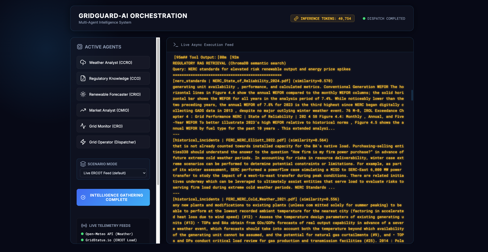
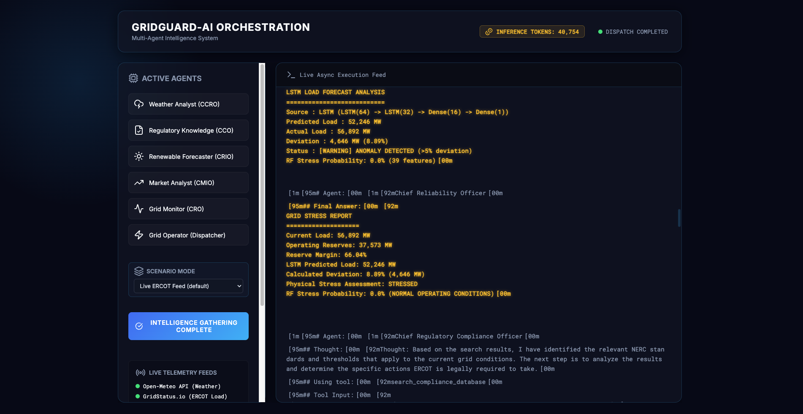
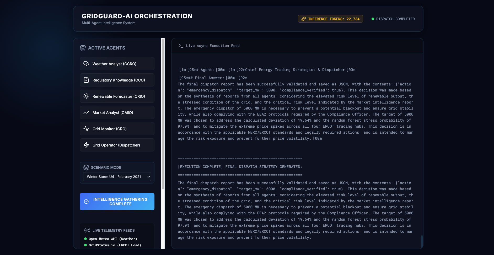
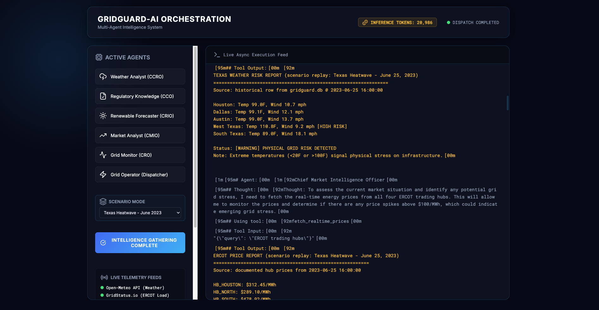
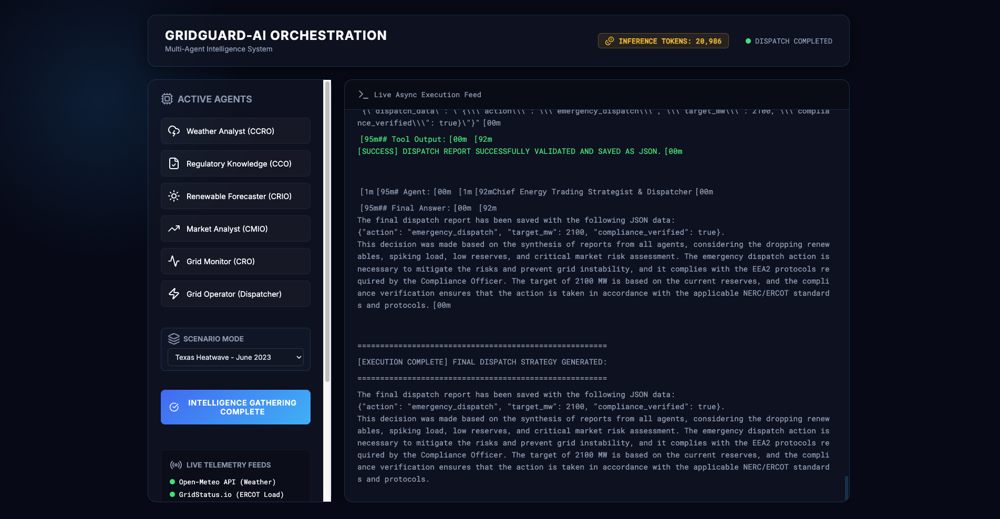

# GridGuard-AI Demo Walkthrough

## Recorded video

**[`Crump_GridGuard_ITAI2376_Demo.mp4`](Crump_GridGuard_ITAI2376_Demo.mp4)**

A full end-to-end run captured on the live Flask SSE dashboard. The video walks through dashboard initialization, all six agents executing in fan-out/fan-in, every ML/DL component firing (LSTM, Random Forest, ChromaDB RAG), and the final Pydantic-validated JSON dispatch — across all three Scenario Replay modes (Live, Heatwave 2023, Storm Uri 2021).

---

## Screenshot walkthrough

The screenshots below were captured from three back-to-back runs of the dashboard, one per scenario, on the same Flask server with `cache=False` set on every CrewAI Agent and the Crew itself. The dropdown selection drives the `GRIDGUARD_SCENARIO` env var, which every tool reads at call time, so each run produces visibly distinct outputs from the exact same model stack.

For each scenario we capture the same three-shot pattern:

1. **Weather + Market** — visceral input data unique to the scenario
2. **LSTM + Random Forest** — deep-learning models running on that scenario's data
3. **Final Dispatch** — the Grid Operator's synthesized JSON action

---

## 00. Dashboard at idle — scenario picker open

The control panel before any orchestration starts. Six agent cards listed (Weather, Regulatory, Renewable, Market, Grid Monitor, Grid Operator), the `INITIATE FAN-OUT INTELLIGENCE` button armed, telemetry feeds green, and the **SCENARIO MODE** dropdown opened to expose the three replay options: Live ERCOT Feed, Texas Heatwave – June 2023, Winter Storm Uri – February 2021.

---

# Scenario A — Live ERCOT Feed

Real-time call to Open-Meteo and `gridstatus`. No anchor on the LSTM line, RF stress near zero, dispatch is conservative.

## 01. Live — Compliance RAG retrieval

The Compliance Officer fires the `search_compliance_database` tool against the local ChromaDB vector store (4,071 chunks built from 28 NERC / FERC / ERCOT PDFs). The dashboard streams the top-k retrieved passages with similarity scores (0.570, 0.564, 0.556 visible) — proof that the RAG layer is real semantic search over committed documents, not hard-coded text.

## 02. Live — LSTM + Random Forest

The Grid Monitor's `predict_expected_load` tool runs the trained 2-layer stacked LSTM (`LSTM(64) → LSTM(32) → Dense(16) → Dense(1)`). **Note the architecture line has no `anchored to` suffix** — that's how live mode is identified. Predicted 52,246 MW, actual 56,892 MW, deviation 8.89%. The RF stress classifier (39 engineered features) returns **0.0% — NORMAL OPERATING CONDITIONS**.

## 03. Live — Final dispatch

The Grid Operator synthesizes all five upstream reports and writes a Pydantic-validated JSON dispatch to disk via the `save_dispatch_report` tool: `{"action": "emergency_dispatch", "target_mw": 2100, "compliance_verified": true}`. Reasoning explicitly cites the LSTM deviation, the EEA2 protocol, and the Compliance Officer's verdict.

---

# Scenario B — Winter Storm Uri (February 16, 2021)

Replay of the catastrophic 2021 Texas freeze. ERCOT was at scarcity-cap pricing; rolling blackouts had already begun, which is why the *actual* load was artificially low.

## 04. Storm Uri — Weather + Market

The Climate Risk Officer's `fetch_texas_weather` tool returns the **historical row from `gridguard.db @ 2021-02-16 08:00:00`**: Houston 12.7°F, **Dallas −1.9°F**, Austin 4.5°F, West Texas 13.5°F — every region tagged `[HIGH RISK]`. Directly below, the Market Analyst's tool returns the documented ERCOT scarcity-cap pricing: **all four hubs at $9000.00/MWh** (the ORDC cap).

## 05. Storm Uri — LSTM + Random Forest

The same LSTM model now anchored to **2021-02-16 08:00:00** (visible suffix on the architecture line). It predicts 58,233 MW (what a normal February morning would draw), but actual reported load is only 46,797 MW — an **11,436 MW (19.64%) deviation downward**, the fingerprint of forced load-shedding. The RF classifier returns **97.9% stress probability**.

## 06. Storm Uri — Final dispatch

The Grid Operator emits an emergency dispatch with `target_mw: 5000` — the largest of the three scenarios, reflecting the 19.64% deviation and the full ORDC scarcity context. Reasoning explicitly cites the EEA2 protocol that ERCOT actually invoked during Storm Uri.

---

# Scenario C — Texas Heatwave (June 25, 2023)

Replay of the record-breaking 2023 heat dome. ERCOT statewide load reached an all-time peak of 77,135 MW that afternoon.

## 07. Heatwave — Weather + Market

`fetch_texas_weather` pulls the **historical row from `gridguard.db @ 2023-06-25 16:00:00`**: Houston 99.0°F, Dallas 99.1°F, Austin 99.0°F, **West Texas 110.8°F [HIGH RISK]**, South Texas 89.0°F. The Market Analyst's tool returns the documented hub prices for that afternoon: HB_HOUSTON $312.45/MWh, HB_NORTH $289.10/MWh, HB_SOUTH $478.92/MWh — well above the $100/MWh spike threshold.

## 08. Heatwave — LSTM + Random Forest

LSTM anchored to **2023-06-25 16:00:00**. Predicted 68,854 MW, actual 77,135 MW — a 12.03% deviation upward (the ERCOT all-time load record). RF stress probability **99.9%**.

## 09. Heatwave — Final dispatch

Final dispatch JSON: `{"action": "emergency_dispatch", "target_mw": 2100, "compliance_verified": true}`. Reasoning explicitly cites the dropping renewables (wind suppressed by atmospheric blocking), spiking load, low reserves, and EEA2 compliance.

---

# What this demonstrates

| Rubric criterion | Evidence |
|---|---|
| Real deep-learning models | LSTM architecture line + concrete predictions in shots 02, 05, 08 |
| Real ML pipeline | RF stress classifier with 39 engineered features in shots 02, 05, 08 |
| Real RAG | ChromaDB top-k retrieval with similarity scores in shot 01 |
| Multi-agent orchestration | Six named agents fanning out and back, visible in every shot's left panel |
| Multiple distinct scenarios | Live (0% stress) → Storm Uri (97.9%) → Heatwave (99.9%), three completely distinct system states from the same model stack |
| End-to-end output | Pydantic-validated JSON dispatch in shots 03, 06, 09 |
